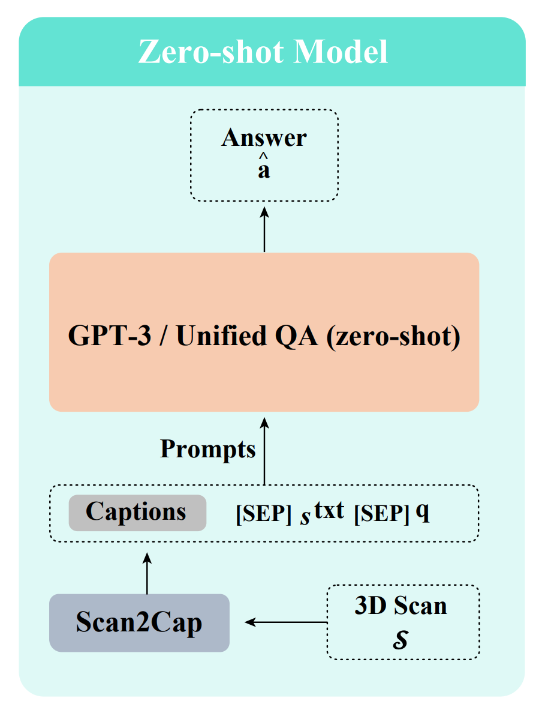

LLM for SQA3D
===
<p align="center"></p>


This doc provide a guide on evaluating large language models (LLMs) on SQA3D questions. Specifically, a 3D scene is first replaced by several scene captions, then the captions, situation text, and question will be sent to an LLM. Finally, we obtaint the response from LLM and compare it against the ground truth answer. More details can be found in Sec. 3 of our [paper](https://arxiv.org/abs/2210.07474).

We offer two models: `gpt-3.5-turbo` and `unified_qa_large`, and two types of scene captions: ScanRefer and ReferIt3D (NR3D variant).

## Setup

1. Install dependencies

    ```bash
    pip install openai transformers tqdm
    ```

2. Put your OpenAI API key to `./eval_sqa3d_llm.py`.

## How to

Just run the evaluation as below:

```bash
 python eval_sqa3d_llm.py <options>
```

Available options:

- `--model` (mandatory), you may choose from `gpt` and `uqa`.
- `--scene_captions` (mandatory), point it to the pre-processed scene caption file. We provide two choices: `scanrefer_captions_by_scene.pkl` (ScanRefer) and `nr3d_captions_by_scene.pkl` (ReferIt3D).
- `--use_gpt_metric` (optional), whether to use GPT-based evaluation metric (see explaination below).

## Troubleshooting

We've found that there might be some small mismatch between the results reproduced from here and those reported in the original paper due to various factors (ex. GPT-3 -> GPT-3.5). But in general, the difference should be minor. Feel free to submit a ticket in the [issue section](https://github.com/SilongYong/SQA3D/issues) if you have any concerns.

We've found that the answer matching strategy use by the original paper may look a bit aggressive. To address this, we additionally provide a GPT-based metric as in [the Lynx paper](https://lynx-llm.github.io/). Basically, we ask GPT if a response is correct given a question and a ground truth answer. In our experiment, we observed the GPT-based metric produced comparable results as the original one (exact matching with a customized answer matching strategy for open-ended text generation model). To use this GPT-based metric, just append `--use_gpt_metric` to the cmd line.

You're free to use any of these two metrics (original and GPT-based) when evaluating your own model on SQA3D. But indeed, the GPT-based metric is encouraged.