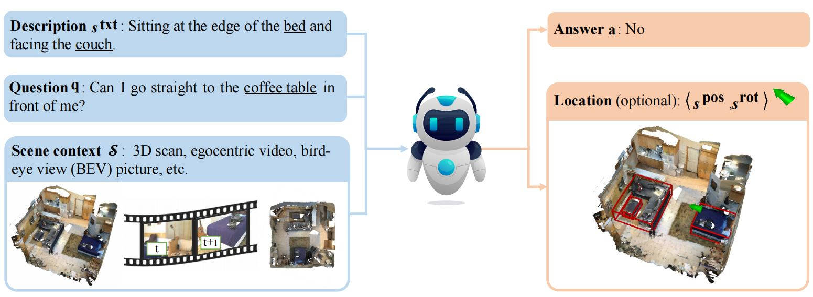

SQA3D
===
<p align="center"></p>

This repository hosts the code for the paper:

[SQA3D: Situated Question Answering in 3D Scenes (ICLR 2023)](https://arxiv.org/pdf/2210.07474.pdf)

by [Xiaojian Ma*](http://web.cs.ucla.edu/~xm), [Silong Yong*](https://silongyong.github.io/), [Zilong Zheng](https://zilongzheng.github.io/), [Qing Li](https://liqing-ustc.github.io/), [Yitao Liang](https://web.cs.ucla.edu/~yliang/), [Song-Chun Zhu](http://www.stat.ucla.edu/~sczhu/) and [Siyuan Huang](https://siyuanhuang.com/)

[🔥Submit your result to PwC!](https://paperswithcode.com/dataset/sqa3d) | [arXiv](https://arxiv.org/abs/2210.07474) | [slides](http://web.cs.ucla.edu/~xm/file/sqa3d_iclr23_slides.pdf)

## News

- 01/30/2023: SQA3D data, code and pretrained weights have beed released!

## Abstract

We propose a new task to benchmark scene understanding of embodied agents: Situated Question Answering in 3D Scenes (**SQA3D**). Given a scene context(e.g., 3D scan), SQA3D requires the tested agent to first understand its situation(position, orientation, etc.) in the 3D scene as described by text, then reason about its surrounding environment and answer a question under that situation. Based upon 650 scenes from ScanNet, we provide a dataset centered around 6.8k unique situations, along with 20.4k descriptions and 33.4k diverse reasoning questions for these situations. These questions examine a wide spectrum of reasoning capabilities for an intelligent agent, ranging from spatial relation comprehension to commonsense understanding, navigation, and multi-hop reasoning. SQA3D imposes a significant challenge to current multi-modal especially 3D reasoning models. We evaluate various state-of-the-art approaches and find that the best one only achieves an overall score of **47.20%**, while amateur human participants can reach **90.06%**. We believe SQA3D could facilitate future embodied AI research with stronger situation understanding and reasoning capability.

## Installation

- Install PyTorch:
    ```shell
    conda install pytorch torchvision torchaudio cudatoolkit=11.3 -c pytorch
    ```

- Install the necessary packages with `requirements.txt`:
    ```shell
    pip install -r requirements.txt
    ```

The code has been tested with Python 3.9, PyTorch 1.12.0 and CUDA 11.3 on Ubuntu 20.04

##  SQA3D data format

Please refer to [data format](assets/dataset.md). Note that we only provide the SQA3D annotations. To obtain the scene data (3D scans, egocentric videos or BEV pictures), please refer to [Training](https://github.com/SilongYong/SQA3D#training). SQA3D data is hosted [here](https://zenodo.org/record/7544818#.Y9eBMMlBx3g).

## Training

For each model, please refer to [ScanQA](./ScanQA/README.md), [MCAN](./MCAN/README.md), [ClipBERT](./ClipBERT/README.md) for details on how to prepare the scene data and run some experiments.

## Misc

Please change to the corresponding directory when running experiments with the models. For example, to experiment with MCAN
```shell
cd MCAN
```

## License

- Code: [Apache](https://github.com/SilongYong/SQA3D/blob/master/LICENSE)

- Data: [CC-BY-4.0](https://creativecommons.org/licenses/by/4.0/)

## Citation
If you find our work helpful for your research. Please consider citing our paper.
```bibtex
@inproceedings{ma2022sqa3d,
  title={SQA3D: Situated Question Answering in 3D Scenes},
  author={Ma, Xiaojian and Yong, Silong and Zheng, Zilong and Li, Qing and Liang, Yitao and Zhu, Song-Chun and Huang, Siyuan},
  booktitle={International Conference on Learning Representations},
  year={2023},
  url={https://openreview.net/forum?id=IDJx97BC38}
}
```
