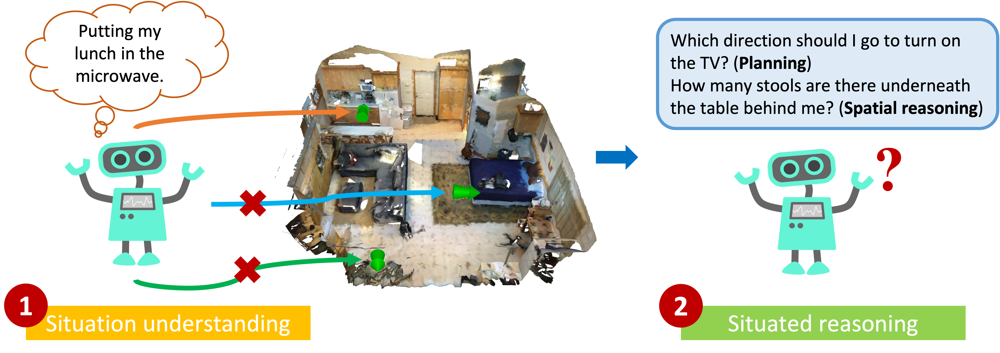

SQA3D Benchmarking and Leaderboard
===

This hosts the benchmarking instructions and leaderboard of SQA3D.

## News

- We've moved! This is the new benchmark and leaderboard site of SQA3D.

## Guide

Please send your result to [xiaojian.ma@ucla.com][mailto:xiaojian.ma@ucla.com]. With the following information:

1. **The task of your submission**. We hosted two tracks for now (you may find more information on our [challenge website](https://scene-understanding.com/challenge.html)):

    - Situation understanding (localization). [Details](./localization.md).
    - Situated reasoning (QA). [Details](../ScanQA/README.md)

2. **Your setting**. Feel free to eloaborate a bit on your model:

    - The scene context you use: Point cloud, video, BEV picture.
    - (QA only): Whether the model uses ground truth location and orientation.

3. The **name** of your model (or team).

4. **Result.** Metrics can be found at [here](./localization.md) (localization) and [here](../ScanQA/README.md) (QA).

## Leaderboard -- localization track

| Rank | Model             | `Acc@0.5m` | `Acc@1.0m` | `Acc@15°` | `Acc@30°` | Information                                                                                      |
|------|-------------------|------------|------------|-----------|-----------|--------------------------------------------------------------------------------------------------|
| 1    | PKU_WICT_2023     |   33.50%   |   70.35%   |   72.74%  |   76.77%  | [details]( https://drive.google.com/drive/folders/1B36-6jE8DfaKdy7-L_V9EeaeF0IMhkPI?usp=sharing) |
| 2    | Tsinghua_AIR_2023 |   34.41%   |   55.27%   |   40.07%  |   44.98%  |                                                                                                  |
| 3    | Random            |    14.60   |    34.21   |   22.39   |   42.28   |                                                                                                  |

## Leaderboard -- QA track

| Rank | Model           | scene context | ground truth situation | `Acc (top-1)` | Information                                                                                     |
|------|-----------------|---------------|------------------------|---------------|-------------------------------------------------------------------------------------------------|
| -    | Human           | 3D            |                        | 90.06         |                                                                                                 |
| 1    | PKU_WICT_2023   | 3D + video    |                        |     54.02     | [details](https://drive.google.com/drive/folders/1fqmHIPQFycDlRBg9oooMhhHER1-ZBDai?usp=sharing) |
| 2    | ScanQA          | 3D            | ✔️                      |      47.2     |                                                                                                 |
| 3    | ScanQA          | 3D            |                        | 46.58         |                                                                                                 |
| 4    | MCAN            | BEV           |                        | 43.42         |                                                                                                 |
| 5    | ClipBERT        | video         |                        | 43.31         |                                                                                                 |
| 6    | GPT-3+ScanRefer | 3D            |                        | 41.00         |                                                                                                 |