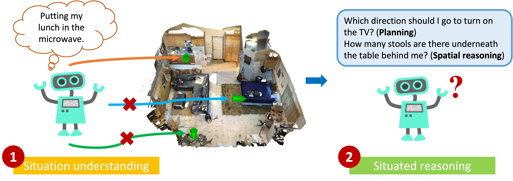

SQA3D Localization task
===
<p align="center"></p>

## Overview

The goal of localization is achieving "situation understanding" as depicted above.
In essense, the task is to predict the current location the agent situates given a 3D scene context and a situation description.

Currently, the location is decomposed into two parts: `rotation` (represented as quaternion in xyzw) and `position` (represented as translation in xyz, unit is **meter**). Starting from the origin, the agent transformation is as follows:

1. Rotate the agent as described by `rotation`.
2. Translate the agent as described by `position`.

## Data

The data for SQA3D localization task can be downloaded [here](https://zenodo.org/record/7792397/files/localization_task.zip?download=1). The format of the data is:

- Run the following code

    ```python
    import json
    a = json.load(open("v1_balanced_localization_train_scannetv2.json", "r"))
    print("#annotations: ", len(a["annotations"]))
    print(a["annotations"][0])
    ```
- The expected output is

    ```json
    {
        "scene_id": "scene0380_00",
        "situation": "I am facing a window and there is a desk on my right and a chair behind me.",
        "alternative_situation":
            [
                "I stand looking out of the window in thought and a radiator is right in front of me.",
                "I am looking outside through the window behind the desk."
            ],
        "position":
            {
                "x": -0.9651003385573296,
                "y": -1.2417634435553606,
                "z": 0
            },
        "rotation":
            {
                "_w": 0.9950041652780182,
                "_x": 0,
                "_y": 0,
                "_z": 0.09983341664682724
            },
    }
    ```
- Explaination

    - `scene_id`: the ScanNetv2 scene id of the current localization problem.
    - `situation`: the situation description.
    - `alternative_situation`: alnativative situation descriptions, might be ambiguous, use on your own risk.
    - `position`: ground truth position, unit is **meter**.
    - `rotation`: ground truth rotation, represented as quaternion.


Please note that due to the coordinate system used by the annotations, we strongly suggest using the original 3D point cloud as 3D scene context input. You may also consider egocentric videos, but please considering adding per-frame camera poses as your input and and the coordinate system used by the camera should align with the point cloud.

## Metric

We evaluate the prediction of `position` and `rotation` seperately. Given a ground truth `<situation description, position, rotation>` and a list of predictions `<[position_1, position_2, ...], [rotation_1, rotation_2, ...]>`, we first find the closest predicted position and orientation to the ground truth, then compute the accuracy based on the threshold. Specifically, we have the following metrics:

- **Acc@0.5m**: If a predicted position is closer than 0.5 meter to the groud truth, it will be accepted. Note only the projected distance on the x-y plane is considered.
- **Acc@1.0m**: Similar to Acc@0.5m but the threshold is 1.0 meter instead.
- **Acc@15°**: If a predicted rotation is closer than 15 degree to the groud truth, it will be accepted. Note only rotation along the z-axis is considered.
- **Acc@30°**: Similar to Acc@15° but the threshold is 30 degree instead.

Please refer to the [evaluation script](../utils/localization_metric.py) for more details.


## Benchmarking

The results should be sumitted to [PwC](https://paperswithcode.com/sota/referring-expression-on-sqa3d).
